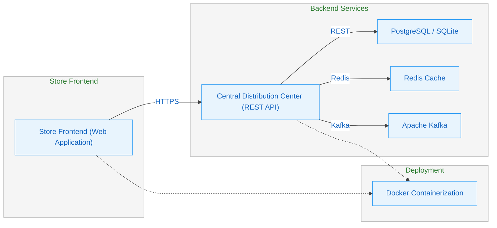
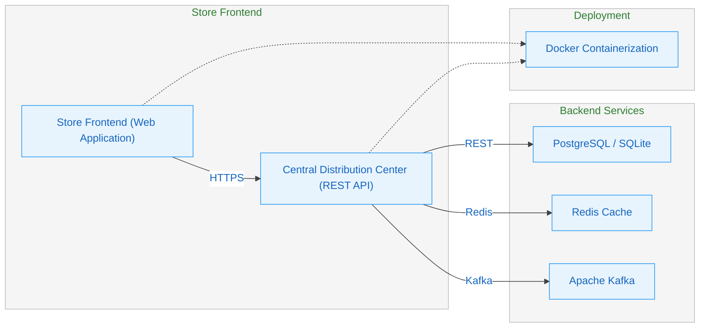
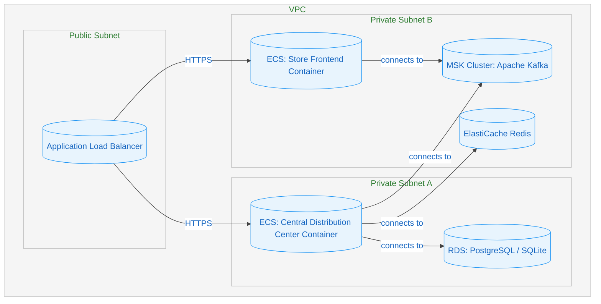

# Regional Supermarket Inventory Tracking System

[](https://codecov.io/gh/ajbarea/regional-inventory-tracker) [](https://sonarcloud.io/summary/new_code?id=ajbarea_regional-inventory-tracker)

This system tracks the inventory in a chain of regional supermarkets and determines the product that will be shipped to each store from a central distribution center.

## Team

- [**Kemoy**](https://github.com/kemoycampbell)
- [**Devaj**](https://github.com/DevajMody)
- [**AJ**](https://github.com/ajbarea)

## Software Architecure Views
### Module View



### Components & Connectors View


### Allocation View



## Quickstart

```bash
python -m venv .venv
source .venv/Scripts/activate  # Windows
python -m pip install --upgrade pip
pip install -r requirements.txt
uvicorn main:app --reload --reload-exclude logs/
```

## API Endpoints

- **GET /** - Health check
- **Docs**: <http://localhost:8000/docs>

## Test

```bash
pytest
```
